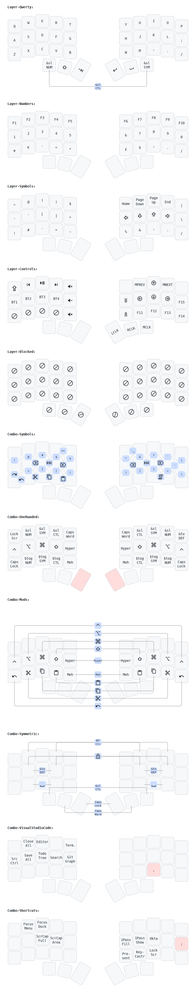

<!-- for copy/paste: ⌘⌥⇧⌃-->
# Personal zmk-config

This is my personal [ZMK](https://zmk.dev) config repo for my [chocofi](https://github.com/pashutk/chocofi) with [nice!nano](https://nicekeyboards.com/nice-nano/) and [nice!view](https://nicekeyboards.com/nice-view).

# :warning: EXPERIMENTAL :warning:

Features or changes on the `experimental` branch depend on forks of ZMK, until specific changes actually land on official ZMK releases.

Updates between `experimental` and `main` may be less frequent.

Current features on this `experimental` branch:

- Uses the [urob fork](https://github.com/urob/zmk), which includes Generic Mouse Emulation (PR [#778](https://github.com/zmkfirmware/zmk/pull/778)), and based on a [pinned message in #pointing-devices in ZMK Discord](https://discord.com/channels/719497620560543766/845285481888743434/1128002387001495583) at the time of this writing (consulting the latest pinned messages is recommended)

## TL;DR

I intentionally avoid having to mess with Tap-Dance, Tap-Hold, Tapping Terms and Permissive Holds altogether and replace them with combos, thus avoiding related mis-fires, while still being able to work efficiently with 34/36 keys. I also gravitate more towards using the home row, using comobs to minimize keystrokes, and avoiding odd positions for common keys.

# Keymap

Illustrations powered by [keymap-drawer](https://caksoylar.github.io/keymap-drawer?keymap_yaml=H4sIAAAAAAAC_-1ZyXrbNhC--ykQ1E2aFnRMUt6Upl9t2UraeEskZ2msqDQJW_xMESwI2nEd99BX6ddbnyKP0ifpACTFRQvp2Gl7yGVEEoMfM4PZAHnWBYtEcw6hX4an_VN6ccQs7jSRzbhP-5wJS1AnGfViXrS9_nrvoNsPA88VffPdUt-cgyHKQwmzLZ-0Z-eUiwv5jpCG3jwj6CVBWwQ9J6hL0GuCDgj6gaA9gvZ7KdM6QR2CNglqE_SYoCcE_UjQU4K2CcIP8YjtJ4JeEdQi6AVBGwTtErQDDAQTtEDQg5TtEuTEd0MP7R7swJC4CGgTnQxYKK4Sjvn5oeM2rSDwqJbqrYUD91jMzxdYRoPCOpo2xKmIuD9tNAwsm44GR6J1Xk8QLbbfbjQ8SgyqlMZtHVhx21DUVLSh6JKiy4quKLqq6Jqi-mJmOKwgFIICUPPVdDVbTVZz1dT8xA9_yi9___6X_NEkeSTJ15J8-EPSeZzsAV6Q5EE2-TKvH0F-5HmTaIGtN7JD52J4xLycHd5K-O8l-UqS-6PFn7Ahlb_71glFm-zcH70cBPJxy3fkz_ucWvfkh58leSNJL9Up8QzO2bnm0WOhgQiOBq7vuT5sY5HBgaVmMkTBzGHungzGV8CHhzlB70jJviga_zdJvpTk7ieyfYv5gueNPzFibCsIM53CUzfQAk7PXBblPgeQH7TAikJaYvXpO5F9OmNeNKRa4MVzY-l29p9vvRgzqe1yG8TImWxnd-tVN540MsBGV4ck0TUkMSVplJYaun5eTntAzzjzNcFdqaTc2_J-KYcYX33MJWazxLs-ztPWl3pFcx95zD7VBtQLKM9Qbv41NUAk6FT9oyCWSZfEkMSUpFHHwbZb25C7nyu6AzTzqw0pD3Wa_46e_-XX3mcVP6t426K0GJTEscI4LbdX097_C-Jja1Zslj2fPrF8J5dd8DYYEHVsrkrlqCHMNWDqsdXdlo8tqGboJePO2EuOqTQ1BRQMbW61cW92uYyLaq4eFMdZIFzmTx222XAI-k0dT_pX6J7BPHz0M5v3o1aqFDTRM-tilDnlbqieTbCT1HLqOTGoeo7tvEMHCcl_HedOUDL42b6UfISQcgg6bSbin9AQOngKPT60a5EQUrWrazLP9Mwd5txqtH72roJ3xWyR77BcNwNc1Ic2KxITPrLgYvxrYIVxP5Q53xSGOmiFhWPZbinPQfofUujS7M8FoGiYF24YWV5HRI7LWsyhJfvglsdCitY9D1LGluMKxlNA3KV8KE9QtaTEHW6jluASB3essxQTd5nDUJdTeRjtUIvbMn89dgV6zK1ggG_djoUMJW8WCL76BHbtDBgX4M_lHIbbzI5CiBQ_wqO3zTjJ38h7MJRsSOmoHcV2TV7XObVG0Fjft8IQtd2YJX4DSc_hbe9UWFNt9BBf1TQ13oc8j0KIZrnCU3qhoRakANVN5DqLW7P3nC3Nraysocugid6YiwSZSz1VfnJdiNVERwxKz5AgdnwcUlALjmleU3Y8uSs43Luay2ER1EiQHn2DE_ZCQyn5R-xLBC0n7Fq_ml2eE3WjlyuUR5Z9qi6_8mfcKhQ4aOpmHmWU9mlo1wEALfXGZDE4PaM8vJY4YAR9-cZKLQPKyk2UWgGA1VtTahXQ1pKtvVe9swb4oKHnV08rbdVEcAmj4BKl2lg1H5zBMCfOTypuFQA4g9GYBDCq5FUIYHmjYPnQ5m4gNEHfiWqbZ0BgQ30xsfmdGtEE7InJ1YVnlZhZ7Kmrwgp2MwsydX9awd7IQkpdOlYnDj1NWW-r2ZezEFO3mRXsK1ksqfvaCvbVLHLUbW8F-1ouNN7X2CYZGot59-C0VmjIbJnGFP4W18qLaSjhS1wrDaahoy64q_gbWaSoy_UaidFIN_k-rpUCjXSXe7hWxjPSbb7CtXJaGqf4uxr8sNFGutGHh7g6gOVWp65RdfyC8ixYkNVmY0EvLCCPg-PFc3UGeHYkKmPrC2YFtlGuPtOPY2XwxYXlCnCzXCCnnQTHoY0K6EaWR5KzJmAMXeca4qnStTapdE3qoCrR9HIxKNWziaAV26OK3MqsIjcBdXFhrQLVzOJtSuWbCFuxJ0YjC3t1Pq67I7naA0uYaWbK3wqlUMVAjA-6xeoF22A28gjJNd1Ejcw6iFO77JLL1gFTsZwqmN4LXkM91S2ufvx85aWTW-jkr-jrgC2XXf4GYHLf4FBBUKrdRhe1PD7R0ku1LS0TUDl7qnvzXHd2Lfw5h1vnfYiXY_dEHsVOvItg0BdW0A_dX-G0Zhj_ABvNdn84IQAA)

The following are my preferences:

| Behaviors | ✅ Preferred | ❌ Not Preferred
-|-|-
General | Combos | Extra Layers / Hold-Tap / Tap Dance
Modifiers | Combo Mods | Home Row Mods / Mod-Taps
Layers | One-shot / Sticky / Toggle Layers | Hold-Tap / Momentary Layers / Conditional Layers
Shift | One-shot / Sticky Shifts and Caps Word | Hold / Hold-Tap Shifts / Auto-Shifts
Nav Keys | Vim-like | WASD-like
Numbers | Home row layout | NumPad layout
Symbols | Multi layouts and combos based on context | Single layer access

## Block Layer

There is a block layer which disables all keys, useful for carrying the keyboard around while travelling without mis-firing any keys.

## Further Reading

* [Combo Mods](https://jasoncarloscox.com/blog/combo-mods/)
* [Home Row Mods](https://precondition.github.io/home-row-mods)
* [Home row mods are hard to use](https://getreuer.info/posts/keyboards/faqs/index.html#home-row-mods-are-hard-to-use)
* [Callum Oakley's mods](https://github.com/callum-oakley/qmk_firmware/tree/master/users/callum)
* [QMK and Keyboards](https://getreuer.info/posts/keyboards/index.html)
* [Timeless homerow mods](https://github.com/urob/zmk-config#timeless-homerow-mods)
