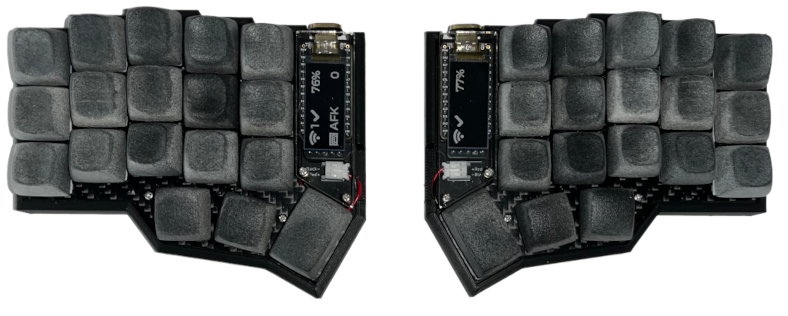
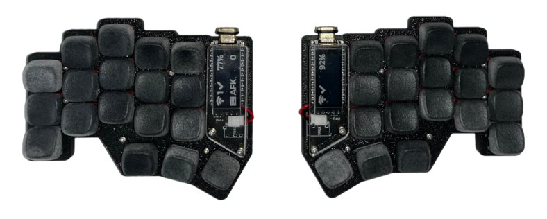
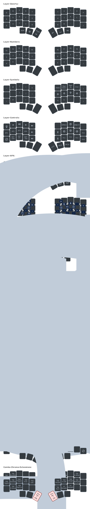

# Personal zmk-config

This is my personal [ZMK](https://zmk.dev) config repo for my wireless 36-keys split keyboards with [nice!nano](https://nicekeyboards.com/nice-nano/) and [nice!view](https://nicekeyboards.com/nice-view).

---

> [!WARNING]\
> This does not use the ZMK Firmware's main branch.
> This layout uses urob's features in the [main-with-native-mouse](https://github.com/urob/zmk/tree/main-with-native-mouse) branch to also include pointer movement/scroll features ([#2027](https://github.com/zmkfirmware/zmk/pull/2027)), which is not yet added to upstream. Use at your own risk.

---

My Wireless Corne 5x3 ...

My Wireless Chocofi ...

# Keymap

The following shows 5 layers, in addition to different Combo schemes.

For instance, there are different ways to access modifiers, including one-handed combos, or two-handed combos.

There are also combos for contractions, punctuations, application shortcuts and more.

The actual combos in `combos.dtsi` are more than illustrated below.

Illustrations powered by [keymap-drawer][1]

### Preferences

The following are my preferences:

| Behaviors | ✅ Preferred | ❌ Not Preferred
-|-|-
General | Combos | Excessive Layers / Hold-Tap / Tap Dance
Modifiers | Combo Mods | Home Row Mods / Mod-Taps
Layers | One-shot / Sticky / Toggle Layers | Hold-Tap / Momentary Layers / Conditional Layers
Shift | One-shot / Sticky Shifts and Caps Word | Hold / Hold-Tap Shifts / Auto-Shifts
Nav Keys | Vim-like | WASD-like
Numbers | Home row layout | NumPad layout
Symbols | Layer / Combo accesses | Single layer access

My typing speed can reach 120wpm levels on MonkeyType's 60-second English typing tests.

At such speeds, it gets harder to tweak the Tapping Terms, Permissive Holds, Tap-Dances and Tap-Holds to minimize mis-fires. And from my own experiences trying these out with QMK, it gets inconsistent across different keyboards I've tried, including Moonlander and Sol3.

I ended up gravitating more towards One-Shots / Sticky Keys and Combos, having less mis-fires, and more mentally relaxed without worrying about holding vs. tapping.

### AFK Layer

Tap the combo "AFK" to toggle the "AFK Layer".

In this layer, all keys and combos are disabled except for combo AFK.

This is useful travelling on the go too, preventing accidental switch-on and mis-firing of any keys.

# Keyboards

I use my layout on these keyboards

### On the go

I use this either when I'm on the go (fits nicely inside standard Nintendo Switch case), or needed quieter typing. Lubing the Choc switches was enough sound dampening for me.

- [chocofi](https://github.com/pashutk/chocofi) PCB
- [nice!nano](https://nicekeyboards.com/nice-nano/) MCU
- [nice!view](https://nicekeyboards.com/nice-view/) display
- switches
  - 28x Kailh Choc Red Pro
  - 4x Kailh Choc Pink
  - 4x Kailh Choc Red
- keycaps: [KLP-Lame Choc](https://github.com/braindefender/KLP-Lame-Keycaps/)
  - 3D-printing and material: MJF PA12-HP Nylon Natural Gray

### On the desk

- 3x5 [Corne Keyboard](https://github.com/foostan/crkbd) PCB
- [nice!nano](https://nicekeyboards.com/nice-nano/) MCU
- [nice!view](https://nicekeyboards.com/nice-view/) display
- switches
  - 32x Akko V3 Piano Pro (modded with 35g springs)
  - 4x Gateron G Pro 2.0 Yellow
- [MX DES by PseudoMakeMeKeyCapProfiles](https://github.com/pseudoku/PseudoMakeMeKeyCapProfiles)
  - 3D-printing and material: MJF PA12-HP Nylon Natural Gray
  - 2x Convex 1.5u
  - 4x Convex 1u
  - 2x R3 Deep Dish
  - 8x R3 Standard
  - 10x R2 Standard
  - 10x R4 Standard

### On mount

Either the Chocofi or Corne fits well in a large phone mount holder.

- 2x Crab Clamp
- 2x Magic Arm 7"
- 2x Rotatable Tripod Phone Mount Holder

I use it for seated or standing positions.

## Further Reading

* [Combo Mods](https://jasoncarloscox.com/blog/combo-mods/)
* [Home Row Mods](https://precondition.github.io/home-row-mods)
* [Home row mods are hard to use](https://getreuer.info/posts/keyboards/faqs/index.html#home-row-mods-are-hard-to-use)
* [Callum Oakley's mods](https://github.com/callum-oakley/qmk_firmware/tree/master/users/callum)
* [QMK and Keyboards](https://getreuer.info/posts/keyboards/index.html)
* [Timeless homerow mods](https://github.com/urob/zmk-config#timeless-homerow-mods)
* [Hyper Key Bindings for VsCode](https://github.com/gilesknap/zsa-voyager-vscode/blob/main/hyperkey.md)

[1]: https://caksoylar.github.io/keymap-drawer?keymap_yaml=H4sIAAAAAAAC_-1bW3PcthV-969AaCdOInK1N109aWutLnazazvatePEVlUsiV2y4hI0CEraOOpk-hv6DzrtUx_61vf0n-SX9BzwTu6Fst1Opk1mDJHgwcHBuXznANi4dM5DuX-HkDezi_MLNh9zKqx9YnLhsXPBJZXMir-6ES3pP_zm6fPReeC7jjzvXG-dd-7AJyYCZNPHJ-OrKybkHN8JMcirr3TytU6OdHKqk5FOvtHJc5081slTnTw7S4ge6mSok0OdHOvkRCePdPJbnXypk75OtAdaSvatTl7qpKeTFzo50MkTnQyAQNd00tDJZkL2FuTUnjwfQLec-2yfTG0eyJv46717M8vZp77vMiNZsxHYzkTeuxeTaIL5jEqySSQda4Vx6QjBZCi8dEjpa-BTk6UfUaASATC-d68iX6TAJ-FsHGtUrVo7bsFStOO2ajuq7ap2S7Xbqt1R7a5q91Tbamaa0xQLxUExUOPVcDVaDVZj1dD8wB__ij0__env-MfA5gtsPsfmx79ge0-LjaA1sNnMBr_Nr08nXui6i9oC2Vmqh-F8NuZuTg-_Q_a_weZTbD5LJ3_EZwz_PqNTRg75lZe-PPfx8ciz8M_3uWXdx47fY_MKm7NkTbF7CMGvDJdNpAEiWAb4vut4DE2WJ7BgqpUEob_ys3CmdnUG7fXrnKAfoWR3i8r_IzYfY_PJf0j3Pe5JkVf-wrAxqR9kawouHN_wBbt0eJjr9gEgDJ-GASuReuxaZl2X3A1nzPDdaGwk3eDZ6dGLikpNR5ggRk5lgydHL0fRoFQBB6MWoMSojU0Hm25pqpnj5eU0bXYpuGdI4eAi0bZleymHqM5ecYnVJJHVqzTHra2zorrHLjcvDJu5PhPKMwB7yfPhgRY_HoySp9HTE628vFCypasL_WjGFjZtbDrYdOu4T7_XB2g-Ve0A2sxrHh5_ub96Bf8LvWuMFGvO5IBekAiY6VBQWpoCiuQ3yyb-MFx-7hKe3fm_d5f_tig9Za9ybl2WHta3Zz8vFu-a9iK1PPXYI-pZzMqKjj4okAxNobJt4JLeqJ88Dr8ZJI9Ruan1ICGSr7mwKi85otLQhKHk5PDoWDtbnXGjvJxLKcXv3JcO95Z-hmCdwfqWfo_rYKjAQT0i_bOa9p1mWitovM6sEFLqRGuosk_yaaI59RwrVD1Heh4wO27yvVXqmEvGfrUvxZ0QUpZCO21kOwH5ks3JBuk_Gmo3y0guFMlpRLLSCwfc-qCR-YsnFTwpIgs9i-fKI6BiHlRloVzQyf15tdenQVRgZY62hKAOt8LEkWwfCNMA6mcMyj7zF7AvKkbtcaiJ3hMY4GHGs9AzZUixo6Qr7acf_oYgcf9S7TPvi-iP1IoTaY_vz9Ru-Yc_q-3xP7TSarX7gRqoUsKvsfkoZbEqjVeOHZCJ62prKo540nS3vGRXsa-tqfE0hDItwrKZdstqU_vXP7UP5co2FxIiJUPH7GjljTC5xYzApEo9Noh6yqhFvjpFgbVjboYBRKkXaunbYZxMhhKPCgZTleNHfDp1GTl8cqjp-ZMbj48Tvo_od-zpJRMR1icUuI0rTD-C_e3Qc_wyIQBUkNAMnCAAdyM96RaJTCoTmmjVVGo371RgagdUAMRYTJAho8K0C-uacc-RXIDggjEvsHk67TFYoijTctqHgtG6tI-cAD7Mi-TcYwCXwRVUSynPUPJjpyzDAkLQz1WRKGBmKBw5TyieXkiqrdvIZOn6gXZzVnUwzCuOqdAhv2tXovo--drx6mqg5_KAkYe3UK_rGo6H1WndESCNVdbKcurI54vUvmABJCaaJFclh-epU-GSP7u-TcdMgnJc45IKh3opZ6iLepAGy6HCpzxMadIK-2YVFH4gCHnhBCF1hzK0HN4DwCgDfWYbPDe0UGHqMBGPtdgVGVBxYcUHjCMmZg2tZqrShsKEKBeK75BepnOMuMXJCCwCL1F8QueJI8mJoL6tKlMogMASpA8ep0aHQnAoEcDlpF3oiCmXwnlRooeQ-i4hSggAxPLkcOiYkRMQgEmBvAtdXB2wgrx9cCly4FJ1Ers-o60NwkbiDh_K8AGa23hCL51pHMTCeGj9IQwk6qzkB-oOAQ3seNQFU-AqVVxtHG2cJlV-nmTofMdiGqAo0BxZ-JFAkMUEpxujjcI-4Bb1UswR_TIn1nDjsDSlIhjwy0Sow43jRRQ5sY83TjYW7U6iAx7qzSO79NkEb0YwIHJ7nRIRnsED0SlAiFxO9dwHmgG9Xk5xikelQPQEUukCfwCKbzmfxQv4trDAIV5RxV9eFr70bOpNWRB_6228KHx97Jmbh8wk0S1MTPRi46BA9EzwsctmCY-DOub8UFWrLfiMGUfXkNOxdMjdj5wwD8oddHMFLCdHygEwMaUF6iHgF1GBjzAeU-XeYzLsfWk896bKw9QrOFvh_aXxVNosAkcqqMcdK3drgRTg8AnGwRtiXuSwkRBxzom_HjsikMlLn2bPg0t0uGzS4pvyj4w0eV0QN_GAEwDKdAkgQg-gE19fODMnnC3SBB2jKyiaHji0y6nVL7ydavWtvOrw4HT94UF_xeHBHRU6yhsM8tbfJ686Oume6eQizehuGBjSdswLBFx3H89U8oeB2tlNNnhLJ9v5weqypPZovFdotfPjx9S8ULei-dppHZc2cOnkuaT7IBaYdRiAClrdxWIAfjER3Eoc0Elr-70XtQ1cdt5nUTvAYPe9F3U35bcL_PYifupadM387aZO2q38_MlRyrqB4BTtglOUDj_WjQd3aHcWjo-PVNYxAHdodxcxSI9q1nEAF2gvdoE6o8H07Z1baBos3Y4trb3Wlg7IRoBpWs28eOzahJIsqndqBy8wKdiX1rJOOeJ9LElrDOyUgxz2boJ55twIgzrju-UYh4rSRKPWj0kM7K2CCPFtaXRNumb0dhkW6AxECGit1e-U0QA9UThBHUPtZkCgfsqwhnwvi_PYOd7AVqiOQ2DENxM_fK3Vgv8iRLgswOwRHY7UgP0EJ9SvM2qgfIIL6qxrHX03gwHtrVYL99uxe2g3Wi2ET0BCHbvVAPQUFs5q0O9msBBpdyoYFC2itoLBE9oJ4n9fA1bQAYqus_wyge4T2BTqhE8mUPzvk3ajVZgALzeqtcLuCubZAX-Zd6vRWcO7XQmvpZcLZebNxvYa5p1K4C-516iybq9h3c0QKb45AR4zx7qFeCpP7y3K08BqzKXks7wm13FrlZ2ulLwXMl1jHpXRd1Zl9AVcm429NVw75SRdSfML2a6xSbubwYC67alrkVyqgyk6CVLl7zMTVsVAjK5tiskSzNDp5jnEF8wLV9SpwxHcpFNIfldsvNhp67BT0Zws8ZPs3rX2ClV9vPseDJSn5iRQt-q3Gb-dq7reYTxaCDZPOkl4HIxIzxXaIo1u1dYoQk0ZJ9URWq7KuRX_O5agV-cQGRNnipvGCeeQQs4lu4aRPZVQLHLlSBv3njPqG0jPBLlsNlo7jSaMmLpz3z6X1D8PnO9gJ9puQ6fahZ5f7YOXKqLgcnoOLAU9D-TcBarv1QZ583PieDYUOhJEhrmhYiOKICDShj361CZhwIik04B8vqmGACfiU5DnrXrF_yaOC8uLGT1Q3Td3Ev4TCHoC2E6wRJ9GB6Qmd7kg6sdKk_gsP8-_ES01PwMwMSZ05rjzfTI8HnCPG6dsGrpU6D0YzF0a6H1nzER0IIoE-oB5Ltdn8Kh2Bg-K3CJltdr-denDBROe4033icfFjLrZV7QJbO3wCkd9x4Q4Ay59NnXGjuvI-YOSSu6aLdO09soqsdiEhq5UpwmobeCWrF4wU-LyK9q929nqjLvNbIYAMv0FrOBud3urtWWWPxhXjiVt8IaVkzsWSyQAf_XcOZrbIk5AlFsCzTnSBNgDvlyQUg0uiAmOC_CnflfpQaH56V7z48_K00empyZuDdDhIk8F0LxmQYG96tdzz0bAfAr2ZVXdtFrtTre9SDfNLl2hm8T2K8TDAyDUVVG46Fgok011VOWaWNYCobbHTau5vXbm-Ld8sYIqqkl-61eZdc5cl18tmJd16KS5Vc8gGP-MzMJAQlybbgim5h78m6h-pQ8FShJPxQI6YzGfqpjUW-DMuy1zZ2eRbpp73XZJN43STxsbucPpJXpvNptrl6kO7MinUVVL3c-qRlYUBStHY96W3cmigU2FoIBNUJx064UiokmOlQIX6pk2FyrDWW4OsCyOtxuATWMaMEwzRZJslQma4ALV_xAC7Zi56bpwlobqKoPrFcOwxerFtRYj5XYeKQviBngjVTXmle1IVoHEra2tZQrKoZtPHTw6EBZT_JFq1VqjGIEcqKtUg9hmw0I2VekPgBYtWak8r4kYY9Qz0sePyai3C_XQrGSMqu5yNlaM38PQNJS8yrQq4m354u0LqG-VVpep0PEy1K7qM6_JqGOlPnerIOyiOsF3A7UJVqJA5eJBFhcYvflAVbOoj1UU2BnvsN3WerexIKWLXAWC1U0keTXUY09tVb19CvFfdnYPMLM8v7q-JSM6dmGFj02ct-cy6oV-Mj-iFcUrflV72cq5NtXEEeaqgi-VtuGYeKgY8ftVjdIsL_SSDxXEisWyMeVHU90P0koi5wULhHkVsfxCQ2VoZ69QouQlJ-ilE8RF1D5OAzYpzX0Ecb1Ma_8G36pyGEM3AAA%3D