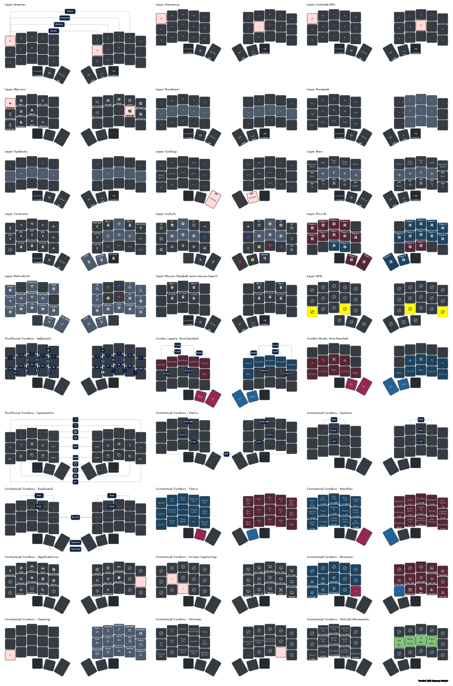
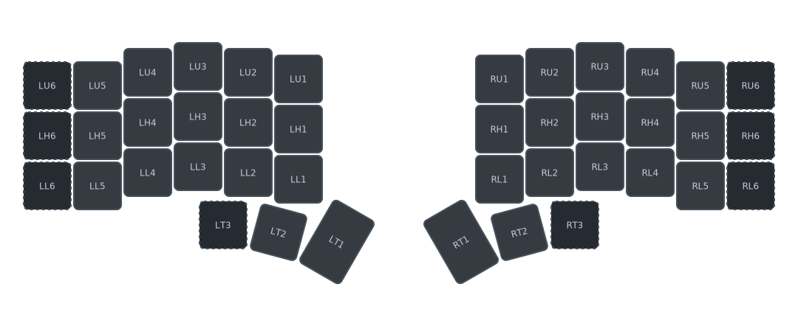

# Terry's zmk-config

---

> [!WARNING]
> This is not yet up-to-date against ZMK Firmware's main branch.
> This layout uses urob's features in the [main-with-native-mouse](https://github.com/urob/zmk/tree/main-with-native-mouse) branch to also include pointer movement/scroll features ([#2027](https://github.com/zmkfirmware/zmk/pull/2027)) at a time when it is not yet added to upstream. Use at your own risk.

---

## Overview

This is my personal [ZMK](https://zmk.dev) keymap files used to customize my keyboards.

## Notation

My keymap is used for [my various keyboards](#my-keyboards), and can work in:
- 34-keys (I don't have one, but considering)
- 36-keys
- 42-keys
- 44-keys (Keyball44)

I use the following notation, both in code and documentation: `{L|R}{U|H|L|T}{1...6}`

- `{L|R}` denotes the left or right hand
- `{U|H|L|T}` denotes the row on the keyboard: Upper Row, Home Row, Lower Row and Thumb Row
- `{1...6}` denotes the column, from innermost (1) to outermost (6)

The layout below has the outermost columns and outermost thumb keys dimmed, as they are optional in my keymaps.

## My Preferences

This keymap heavily uses combos and Vim-like controls.

Layers and combos are set with context in mind, so you may find the same numbers and symbols laid out differently in multiple layers and combos.

More about [my preferences](./docs/preferences.md)

## Layers

- [Alpha Layers](./docs/layers.md#alpha-layers)
  - [Qwerty](./docs/layers.md#qwerty-layout)
  - [Harmony](./docs/layers.md#harmony-layout)
  - [Colemak-DH](./docs/layers.md#colemak-dh-layout)
- [Num and Sym Layers](./docs/layers.md#num-layers)
  - [Numbers](./docs/layers.md#numbers)
  - [Numpad](./docs/layers.md#numpad)
  - [Symbols](./docs/layers.md#symbols)
  - [Coding](./docs/layers.md#coding)
- [Functional Layers](./docs/layers.md#functional-layers)
  - [Nav](./docs/layers.md#nav)
  - [Controls](./docs/layers.md#controls)
- [Gaming Layers](./docs/layers.md#gaming-layers)
  - [Switch](./docs/layers.md#switch)
  - [Pico-8](./docs/layers.md#pico-8)
  - [RetroArch](./docs/layers.md#retroarch)
- [Keyball-specific Layers](./docs/layers.md#keyball-specific-layers)
  - [Auto-mouse](./docs/layers.md#auto-mouse)
  - [Scroll](./docs/layers.md#scroll)
  - [Snipe](./docs/layers.md#snipe)
- [AFK Layer](./docs/layers.md#afk-layer)

## Combos

- [Essential Combos](./docs/combos.md#essential-combos)
  - [Combo Mods](./docs/combos.md#combos-mods)
  - [Combo Layers](./docs/combos.md#combo-layers)
- [Positional Combos](./docs/combos.md#positional-combos)
  - [Adjacent Combos](./docs/combos.md#adjacent-combos)
  - [Symmetric Combos](./docs/combos.md#symmetric-combos)
- [Contextual Combos](./docs/combos.md#contextual-combos)
  - [Panic Combos](./docs/combos.md#panic-combos)
  - [System Combos](./docs/combos.md#system-combos)
  - [Keyboard Setting Combos](./docs/combos.md#keyboard-combos)
  - [Tmux Combos](./docs/combos.md#tmux-combos)
  - [NeoVim Combos](./docs/combos.md#neovim-combos)
  - [Application Combos](./docs/combos.md#application-combos)
  - [Browser Combos](./docs/combos.md#browser-combos)
  - [Capturing Combos](./docs/combos.md#capturing-combos)
  - [Gaming Combos](./docs/combos.md#gaming-combos)
  - [VsCode Combos](./docs/combos.md#vscode-combos)
  - [VsCode Movement Combos](./docs/combos.md#vscode-movement-combos)

<!-- TODO: Doc: Diagonal Combos -->

<!--
## TODO: Doc: Special Features

- Thumb Shift
- Caps Word
- Repeat Key
- Mouse Keys
- Coding Macros
-->

## My Keyboards

- [Urchin](./config/urchin.md)
- [Chocofi](./config/corne.md)
- [Corne 36 keys](./config/corne.md)
- [Eyelash Corne](./config/eyelash_corne.md)
- [Corne-ish Zen](./config/corneish_zen.md) ([Forked](https://github.com/a741725193/zmk-config-zen-2))
- [Keyball44](./config/keyball44.md)

## References

- [ZMK Docs](https://zmk.dev/docs)
- [Keymap Drawer](https://github.com/caksoylar/keymap-drawer)
- [Keymap DB](https://keymapdb.com/)
- [Combo Mods](https://jasoncarloscox.com/writing/combo-mods/)
- [Home Row Mods](https://precondition.github.io/home-row-mods)

## Todo

In no particular order yet, here are some things I'd like to try or get done.

- Update to work with latest zmk main branch
- Try [Leader Key](https://github.com/urob/zmk-leader-key)
- Try [Auto Layer](https://github.com/urob/zmk-auto-layer)
- Try [Adaptive Key](https://github.com/urob/zmk-adaptive-key)
- Try [&amp;df feature](https://github.com/zmkfirmware/zmk/issues/1299) with Conditional Layers and other keyboard layouts
