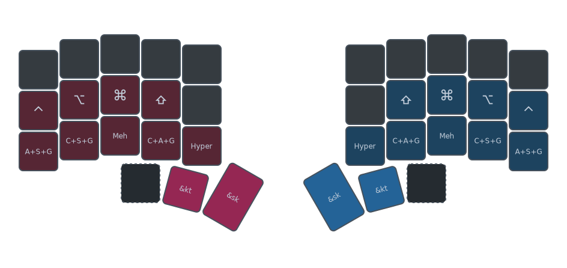
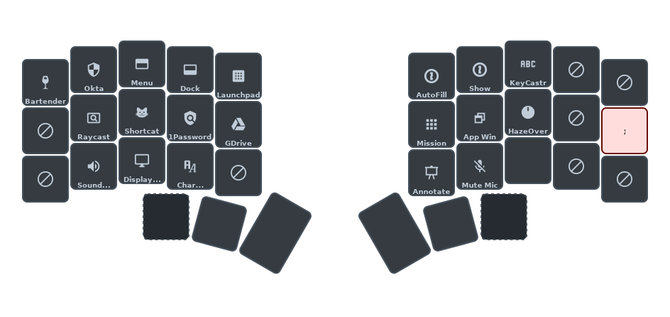
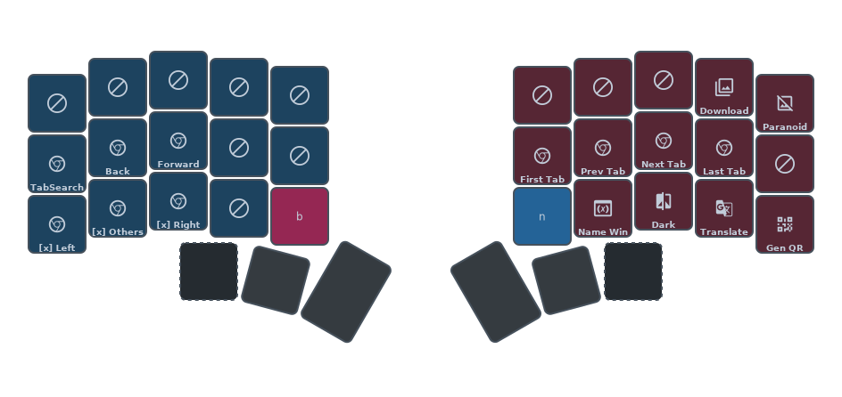
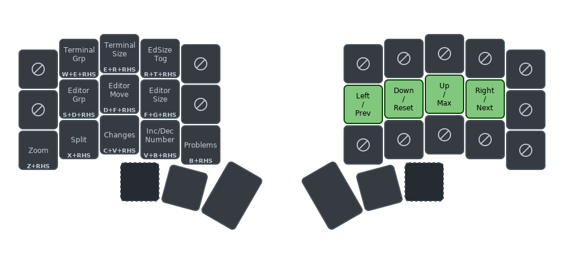

# Combos

My keymaps are combo-heavy, compatible with a minimum of 34-key split keyboards, under three main categories:

- [Combo Layers](#combo-layers)
  - one-handed combos
  - activate layers with [Sticky Layer](https://zmk.dev/docs/keymaps/behaviors/sticky-layer) or [Layer Toggle](https://zmk.dev/docs/config/behaviors#layer-toggle)
- [Combo Mods](#combo-mods)
  - one-handed combos
  - any modifier combinations are possible
  - activate modifiers with [Sticky Key](https://zmk.dev/docs/keymaps/behaviors/sticky-key) or [Key Toggle](https://zmk.dev/docs/config/behaviors#key-toggle)
- [Contextual Combos](#contextual-combos)
  - combo sets specific to certain context, applications or purposes
  - uses memorable "Base Keys" as part of each combo in the same combo set

## Essential Combos

### Combos Mods

I use the [CAGS][1] (Ctrl, Alt, Gui, Shift) layout for Combo Mods.

Combo Mods are performed one-handed, using one thumb key and a non-thumb key.

Both sides are symmetrical, and all possible modifier combinations can be performed.

There is also a set of [Symmetric Combos](#symmetric-combos) to activate modifiers with both hands.

You can either use <kbd>&sk</kbd> (Sticky Key) or <kbd>&kt</kbd> (Key Toggle), plus any key on the same side shown with the same color in the diagram.

Each lower row keys (except for <kbd>Hyper</kbd>) is the opposite of the key above it. For example, <kbd>C+A+G</kbd> is just lacking <kbd>Shift</kbd>, <kbd>Meh</kbd> is just lacking <kbd>Command</kbd>, etc.

To invoke a Stickey Key <kbd>Meh</kbd>, any of the following can be used:
- <kbd>&sk Meh</kbd> (two keys, one keystroke)
- <kbd>&sk Shift Alt Ctrl</kbd> (four keys, one keystroke)
- <kbd>&sk Shift</kbd> + <kbd>&sk Alt</kbd> + <kbd>&sk Control</kbd> (two keys, three keystrokes)
- <kbd>&sk Shift</kbd> + <kbd>&sk Alt Control</kbd> (mixed keys, two keystrokes)
- all other similar combinations
- or use [Symmetric Combos](#symmetric-combos) with both hands

### Combo Layers

Similar to Combo Mods, Combo Layers are performed one-handed, using one thumb key and a non-thumb key.

Both sides are symmetrical.

You can either use <kbd>&sl</kbd> (Sticky Layer) or <kbd>&tog</kbd> (Layer Toggle), plus any key on the same side shown with the same color in the diagram.

As there are 6 available non-thumb keys on each side, there are 6 possible Combo Layers that only require a two-key combo.

For other layers I don't often use, they require a three-key combo. For instance, the Scroll layer to activate scroll mode on a Keyball keyboard can be activated with <kbd>&tog RU3 RU4</kbd> or <kbd>&tog LU3 LU4</kbd>.

## Positional Combos

### Symmetric Combos

These set of combos are two-key combos activated by symmetrical keys on both hands.

For instance, <kbd>LH5 RH5</kbd> activates <kbd>Control</kbd>, <kbd>LL2 RL2</kbd> activates <kbd>Paste</kbd>, and so on.

All modifier combos here use <kbd>&sk</kbd> (Sticky Key).

Home row is [CAGS][1] (Ctrl, Alt, Gui, Shift) layout, and lower row is Undo, Cut, Copy, Paste (also accessible with [Adjacent Combos](#adjacent-combos)), while Meh and Hyper are on the first column on both sides.

### Adjacent Combos

Adjacent Combos simply are combos using keys that are adjacent to each other:

- horizontally adjacent
- vertically adjacent
- diagonally adjacent

Some possible combos (mostly involving the pinkies) are deliberately not set, as from my experience they cause more misfires for me).

#### Horizontal Combos

Examples:

| Combo | Qwerty Equivalent | Activates |
| - | - | - |
| <kbd>RH1 RH2</kbd> | HJ | <kbd>BS</kbd> |
| <kbd>RH2 RH3</kbd> | JK | <kbd>Esc</kbd> |
| <kbd>RH3 RH4</kbd> | KL | <kbd>Del</kbd> |
| <kbd>RL1 RL2</kbd> | NM | <kbd>Alt</kbd> + <kbd>BS</kbd> |
| ... | ... | ... |
| <kbd>LL5 LL4</kbd> | ZX | Undo |
| <kbd>LL4 LL3</kbd> | XC | Cut |
| <kbd>LL3 LL2</kbd> | CV | Copy |
| <kbd>LL2 LL1</kbd> | VB | Paste |
| ... | ... | ... |

<!-- TODO: Diagonal Combos -->

## Contextual Combos

Contextual Combos are combo sets for specific applications, purposes or contexts.

They can either be specific subsets of combo layouts, or a set that uses one or more specific keys as "Base Keys", like <kbd>B</kbd> for Browser plus another key to activate a browser-specific shortcut or macro.

### Panic Combos

There are four Panic Combos which can be used in almost all layers.
- AFK combo
  - a four-key combo, requiring both sides, that toggles the AFK layer.
- Panic Combo
  - a two-key combo, available on both sides, that releases all modifiers and resets to the bottom layer (Qwerty).
  - This is useful when you lose track of which layer or modifier is activated either on purpose or by accident.
- Two home row combos used for App/Window switching, which are essentially <kbd>Cmd + Tab</kbd> and <kbd>Cmd + `</kbd>

### System Combos

Three-finger combos, symmetrical on both sides, that does "Force Quit", "Mute" and "Sleep" on MacOS.

### Keyboard Setting Combos

Thumb combos for Caps Word and Caps Lock.

Three-finger combos for keyboard bootloader, reset and clearing Bluetooth pairing.

### Tmux Combos

Tmux Combos are two-handed combos activated with one thumb key (<kbd>LT2</kbd> or <kbd>RT2</kbd>), and any non-thumb key on the opposite side (shown as same colors in the diagram).

While most of these are for native tmux features, some require [certain tmux plugins that I use](https://github.com/terryyounghk/dotfiles/blob/main/dot_tmux.conf).

### NeoVim Combos

NeoVim Combos are two-handed combos activated with one thumb key (<kbd>LT1</kbd> or <kbd>RT1</kbd>), and any non-thumb key on the opposite side (shown as same colors in the diagram).

While some of these are for native NeoVim features, some require [certain NeoVim plugins that I use](https://github.com/terryyounghk/dotfiles/tree/main/private_dot_config/nvim/lua).

### Application Combos

Application Combos are activated with <kbd>;</kbd> and any other non-conflicting key.

The list of app functions include:
- Activate Okta browser extension
- MacOS System Menu
- MacOs Dock
- MacOs Launchpad
- 1Password Auto-fill
- Open 1Password
- Toggle KeyCastr
- Search Bartender
- Search Raycast
- Activate Shortcat
- Search 1Password
- Search Google Drive
- MacOs Mission Control
- MacOs Exposé
- Toggle HazeOver
- MacOs Sound Settings
- MacOs Display Settings
- MacOs Keyboard Settings
- MacOs Emoji / Symbols
- Presentify: Toggle Annotate
- MacOs Mute Microphone

### Browser Combos

Browser Combos are activated with the <kbd>B</kbd> key (B for Browser) plus any non-thumb key that's fairly accessible and not adjacent to the <kbd>B</kbd> key.

Home row keys on the right are for browser tab switching.

Keys on the left trigger vanilla [SurfingKeys](https://github.com/brookhong/Surfingkeys) shortcuts that I use the most.

### Capturing Combos

Capturing Combos are for screen/text capturing, activated by two Base Keys <kbd>S</kbd> and <kbd>C</kbd> (S for Screen, C for Capture) plus any non-thumb key on the opposite side.

I use [Clean Shot X](https://cleanshot.com/) for screen capturing, and [TextSniper](https://textsniper.app/) for text capturing.

> [!NOTE]
> I use VsCode less nowadays, these combos are not as up-to-date as the others and are subject to changes or removal.

This set of VsCode Combos are activated with the <kbd>.</kbd> key plus a different key for things I use the most. Although most of the time I use the Command Palette and fuzzy search for features to use.

### VsCode Movement Combos

> [!NOTE]
> I use VsCode less nowadays, these combos are not as up-to-date as the others and are subject to changes or removal.

This set of VsCode Combos are activated with one of the <kbd>RH1</kbd>/<kbd>RH2</kbd>/<kbd>RH3</kbd>/<kbd>RH4</kbd> (HJKL) keys plus a different key on the left.

These mostly are for UI movement or resizing, or traversing certain lists or shifting values

[1]: https://precondition.github.io/home-row-mods#cags
