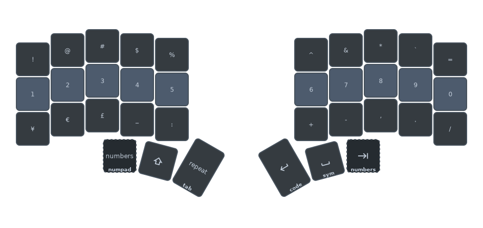
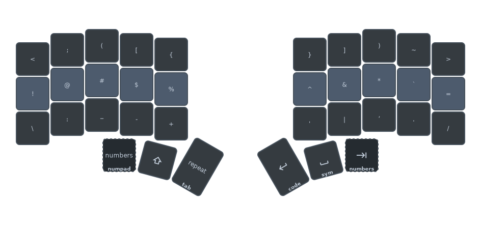
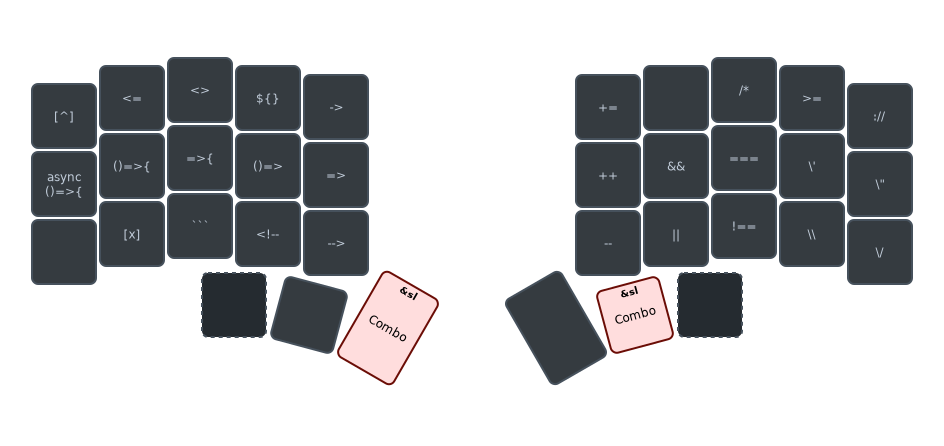
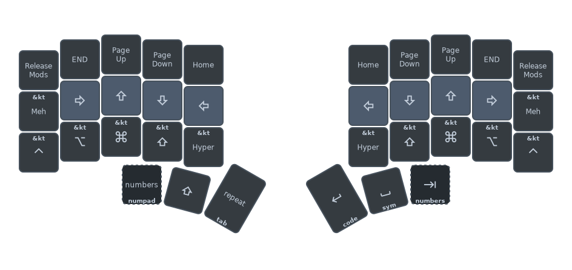
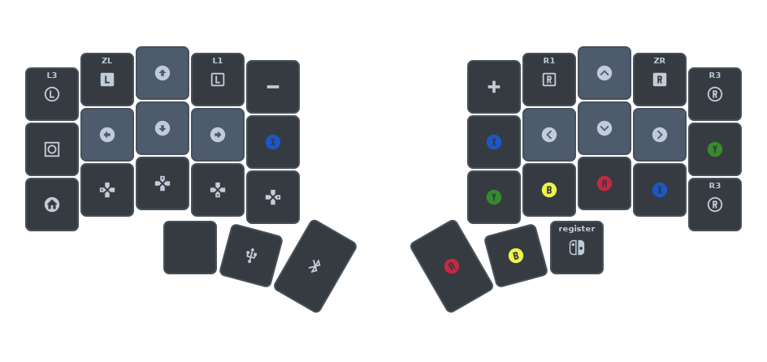
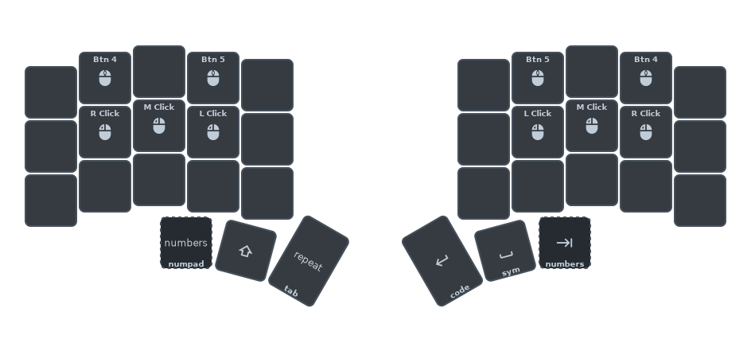

# Layers

## Alpha Layers

My primary typing layer is Qwerty, but I'm open in learning other layouts.

I use combos to switch between them, as I don't switch too often.

The base combo key is <kbd>Q</kbd>, plus <kbd>H</kbd> (Qwerty), <kbd>J</kbd> (Harmony) or <kbd>K</kbd> (Colemak-DH).

### QWERTY Layout

Nothing special with Qwerty itself, so description here is more on introducing the thumb clusters.


The thumb keys remain the same on all layers except for the Numpad layer.

I am right-hand dominant, and my thumb's resting positions are <kbd>Space</kbd> on the right, and <kbd>Shift</kbd> on the left.

The second most used thumb keys are <kbd>Enter</kbd> on the right, and <kbd>Repeat</kbd> on the left.

The third outermost thumb keys are optional:
- <kbd>Tab</kbd> have equivalent combo keys, and on Keyball keyboards, it's positioned on the right of the trackball, which means it's typed with the pinky if needed
- Left third outermost thumb key is a special Hold-Tap where tap is a <kbd>&sl</kbd> switch to "Numbers" layer and hold is a <kbd>&mo</kbd> to "Numpad" layer

### Harmony Layout

This layer is based on the [Harmony keyboard layout](https://github.com/bottilabo/harmony-keyboard-layout).


### Colemak-DH Layout

This layer is based on the [Colemak-DH keyboard layout](https://colemakmods.github.io/mod-dh/).


## Num Layers

### Numbers

This layer places all numbers on the home row.



I use this layer for short bursts of number typing, such as dates, times or small digits when coding.

The upper row resembles same symbols a Qwerty keyboard's number keys, except for `9` and `0`, which are replaced with `` ` `` and `=` respectively.

The lower row are currency symbols plus symbols commonly used with numbers.

### Numpad

This layers places all numbers on the right in a numpad layout, with Fn keys on the left.

I use this more on spreadsheets and number-heavy calculations.


## Sym

### Symbols

This layer places all symbols on the home row, mostly resembling same symbols a Qwerty keyboard's number keys, except for `9` and `0`, which are replaced with `` ` `` and `=` respectively, same as the Numbers layer.



The upper row consists mainly with different brackets commonly used in coding.

The lower row consists of other symbols commonly used in coding.

### Coding

This layer consists of coding symbol sequences as macros common to most languages with more focus on TypeScript.



This layer is accessible with the combo <kbd>LT1</kbd> and <kbd>RT2</kbd> that uses <kbd>&sl</kbd> (Sticky Layer), as most of these only require one-shot keystrokes most of the time.

One notable thing notable the left side of home row are variations of TypeScript function calls.

## Functional Layers

### Nav

This layer is symmetrical on both sides, with Vim-like arrow keys.



The modifiers on this layer are specifically <kbd>&tog</kbd> Toggle Keys, saving the need for combo mod keystrokes.

The upper pinky <kbd>Release Mods</kbd> is a macro that resets any toggled modifiers.

### Controls

This layer have keyboard/media controls on the left, and mouse controls on the right.

In MacOS, <kbd>F14</kbd> and <kbd>F15</kbd> are Brightness Down and Up respectively.


## Gaming Layers

One thing to note about the Gaming Layers is that most combos are not available on these layers, as combos easily conflict and trigger misfires in this scenario.

Once you toggled into a Gaming Layer, use the [Panic Combo](./combos.md#panic-combos) to return to the bottom layer first.

### Switch

This gaming layer is very specific to the [IINE Keyboard and Mouse Adapter for Switch](https://www.iine.top/index.php?m=content&c=index&a=show&catid=205&id=181).




For something that is low cost and just plug-and-play, there is very little to no documentation, and this accessory does not allow custom mapping.

Fortunately, I can do the mapping on the keyboard level instead.

Here's the fixed mapping for the accessory:

```text
/* 
 * LJ = Left Joystick
 * RJ = Right Joystick
 * DP = D-Pad
 *
 *                      Switch              Xbox One            PS4
 * Mouse controls:
 * =====================================================================
 * Right Button         ZL                  LT                  L2
 * Left Button          ZR                  RT                  R2
 * Middle Button        R3                  R3                  R3
 * Move Up              RJ Up               RJ Up               RJ Up
 * Move Left            RJ Left             RJ Left             RJ Left
 * Move Down            RJ Down             RJ Down             RJ Down
 * Move Right           RJ Right            RJ Right            RJ Right
 *
 * Keyboard controls:
 * =====================================================================
 * Q                    L1                  L1                  L1
 * E                    R1                  R1                  R1
 * F1                   DP Up               DP Up               DP Up
 * 1                    DP Left             DP Left             DP Left
 * 2                    DP Down             DP Down             DP Down
 * 3                    DP Right            DP Right            DP Right
 * R                    Y                   Y                   ∆
 * F                    X                   X                   ☐
 * C                    B                   B                   ◯
 * Space                A                   A                   X
 * W                    LJ Up               LJ Up               LJ Up
 * A                    LJ Left             LJ Left             LJ Left
 * S                    LJ Down             LJ Down             LJ Down
 * D                    LJ Right            LJ Right            LJ Right
 * Left Shift           L3                  L3                  L3
 * Tab                  -                   View                Option
 * Esc                  Home                Home                PS
 * -                    Capture             Share               Share
 * Caps Lock            +                   Menu                /
 */
```


### Pico-8

This gaming layer is specific to playing [PICO-8](https://www.lexaloffle.com/pico-8.php) games using the [default keys](https://www.lexaloffle.com/dl/docs/pico-8_manual.html#_Keys).

I primarily play as "Player 1", and the "X/O" action buttons are mapped in multiple places, allowing me to play single-handed or with both hands.

For testing purposes, "Player 2" keys are mapped to the right hand.


## Keyball-specific Layers

The Keyball layers consist of three layers:
- auto-mouse: a layer that is automatically activated when the trackball is moved
- scroll: a layer that sets trackball to scroll mode
- snipe: a layer that sets a different trackball sensitivity, typically used for sniping games

### Auto-mouse

This layer is automatically activated when the trackball is moved, and deactivated when the trackball is not moved for a certain period of time.

Both sides are symmetrical.



### Scroll

There are no special key assignments on this layer, but it sets the trackball to scroll mode.

### Snipe

There are no special key assignments on this layer, but it sets the trackball to a different sensitivity, typically used for sniping games.

## AFK Layer

On this layer, all keys are inactive individually. 

Simply toggle this layer with the combo highlighted in the diagram.


