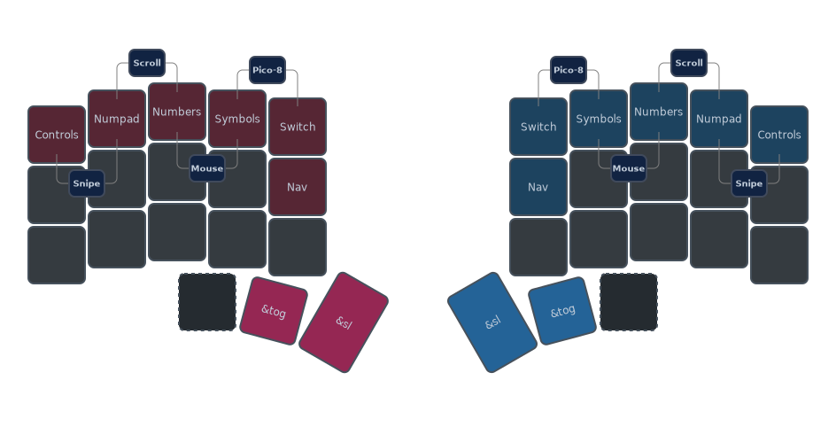
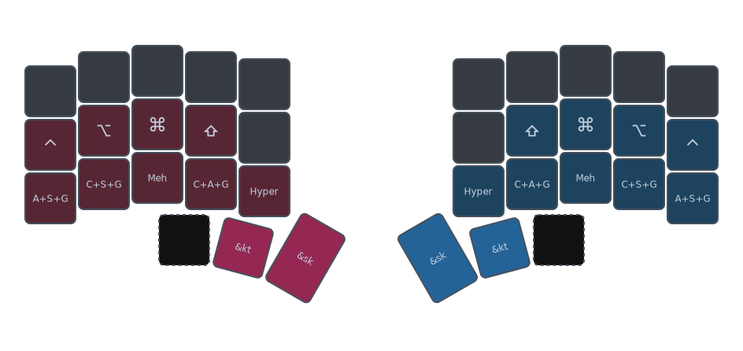

# My Preferences

The keymap heavily uses combos and Vim-like controls.

Layers and combos are set with context in mind, so you may find the same numbers and symbols laid out differently in multiple layers and combos.

| Behaviors | ✅ Preferred | ❌ Less Preferred
-|-|-
General | Combos | Hold-Tap / Tap Dance
Modifiers | Combo Mods (One-shot / Sticky / Toggles) | Home Row Mods / Mod-Taps
Layers | One-shot / Sticky / Toggle Layers | Hold-Tap / Momentary Layers
Shift | One-shot / Sticky Shifts and Caps Word | Hold-Tap Shifts / Auto-Shifts
Nav Keys | Vim-like | Arrow keys / WASD

## Why Combos Over Layers?

Combos, or *Chording*, is not a major issue for me. Since I also play the piano, I have fairly good combo accuracy and I am quite accustomed to it.

I avoid the following in particular:
- Hold Activation: avoiding hold-related misfires altogether
- Double Taps: I haven't been able to find the sweet spot regarding the timing in tap-dances

So instead of slowing down my typing to ensure hold activation, or slowing down of constant misfires of unsuccessful double tap timing, I use combos.

## Devising a Memorable Combo Scheme

The driving principle of how I plan my combos, is to have one key be the "Base Key" of a set of combos sharing the same theme.

Combos that use a thumb key as a Base Key represent things that I use most frequently, such as switching layers, modifiers, etc.

Combos that do not involve thumb keys, and are not adjacent keys, get trickier to memorize if not well thought out.

This is where the concept of "Base Keys" come in.

For instance, combos with the <kbd>B</kbd> key as the Base Key can represent actions related to the browser or browser extensions, so we may have these combos to start with:

Combo | Shortcut Equivalent | Function |
-|-|-|
<kbd>B</kbd> + <kbd>H</kbd> | <kbd>Ctrl</kbd> + <kbd>Shift</kbd> + <kbd>Tab</kbd> | Previous Tab
<kbd>B</kbd> + <kbd>J</kbd> | <kbd>Cmd</kbd> + <kbd>[</kbd> | Back History
<kbd>B</kbd> + <kbd>K</kbd> | <kbd>Cmd</kbd> + <kbd>]</kbd> | Forwary History
<kbd>B</kbd> + <kbd>L</kbd> | <kbd>Ctrl</kbd> + <kbd>Tab</kbd> | Next Tab
... | ... | ...

### Combo Layers

These are one-handed combos, mirrored on both sides, so any hand can use a thumb key plus another key on the top row to perform the combo.

While all letters, symbols, arrow keys have dedicated single keys in their related layers, for every dedicated key tap that is used for layer switching, you get one less key available for tapping.

I solve this by accessing layers with combos. Sticky Layers and Layer Toggles have similar combo patterns, so it's easy to commit to muscle memory.

All such combos require one thumb and another finger (which is important later)

I use the Sticky Layer combos as a "One-shot Layer" if I only need to tap one key on another layer.

Since these are Sticky Layer combos, when hitting this combo, if I keep my thumb on hold, then this is effectively the same as having one thumb key performing a Momentary Layer switch, so I can continue typing on that layer, until I release the thumb.

If I know I need to stay on that layer longer, I would use the Layer Toggle combos instead, which is just the same set of combos but using an adjacent thumb key instead.

I still reserve minimal thumb keys for Hold-Tap / Momentary Layer switching, but they already have combo equivalents.

### Combo Mods

These are one-handed combos, mirrored on both sides, so any hand can use a thumb key plus another key either on the home row or the bottom row to perform the combo.

With a keyboard of 5 columns, or 36 keys or less, you're basically cornered to either thumb keys or home row keys to ergonomically access modifier keys in some way.

I tried Home Row Mods, and the same misfiring issues due to sensitive timing on hold activation and releases makes it frustrating to use and keep adjusting the firmware. And this is not a good solution if one's typing speed either improves or slows down over time.

I solve this by creating an exhaustive list of combos for any modifier combination, but still being easy to remember because. The combos use the same keys as Home Row Mods, but with the addition of thumb keys, one for activating Sticky Keys, and the other thumb key for activating Key Toggles.

### Home Row Combos

These are two-handed combos, requiring a thumb key on one hand, and a home row key on the opposite hand.

This set of combos are specific to numbers and their shifted characters (you see them printed on traditional keycaps).

While all numbers and their associated symbols have dedicated single keys in their related layers, accessing them requires one combo to switch layer, then another keystroke for typing the actual key.

Many times if I only needed to type one or two of these characters, I can simply do one or two combos.

### Contextual Combos

I also heavily use keyboard shortcuts. And as a NeoVim user, I have not been using a mouse for years. With so many applications and customizations that use lots of shortcuts or commands, you'll start to override default shortcuts. And when you get more functions that strongly associates with a certain key character, you run out of (or lose track of) which modifier combination is for what functionality.

## HJKL vs Inverted-T

It is not a strict rule, but I tend to use:
- Vim HJKL for text/value manipulation and navigation
- Inverted-T for arrows and mouse/visual/game controls

The following are just examples of what HJKL may represent, and is part of the guiding principles on how I set my keymaps.

| H | J | K | L | Examples
-|-|-|-|-
| Left | Down | Up | Right | Arrow Keys, Pointer Control, Game D-Pad, Tree Nav...
| Min/Reset | Decrement | Increment | Max | Number manipulation (Text/IDE), Zooming...
| Dec. Width | Dec. Height | Inc. Height | Inc. Width | Resizing
| First | Prev | Next | Last | Tab Switching, Text Jumps, History...
<!-- | Collapse All | Collapse | Expand | Expand All | Tree/Dir/Folder Navigation -->

